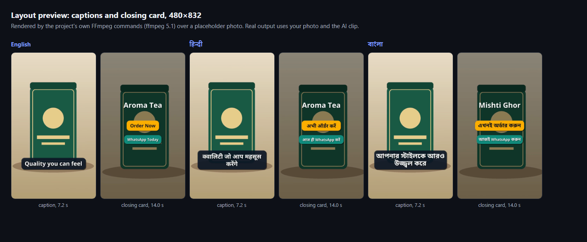
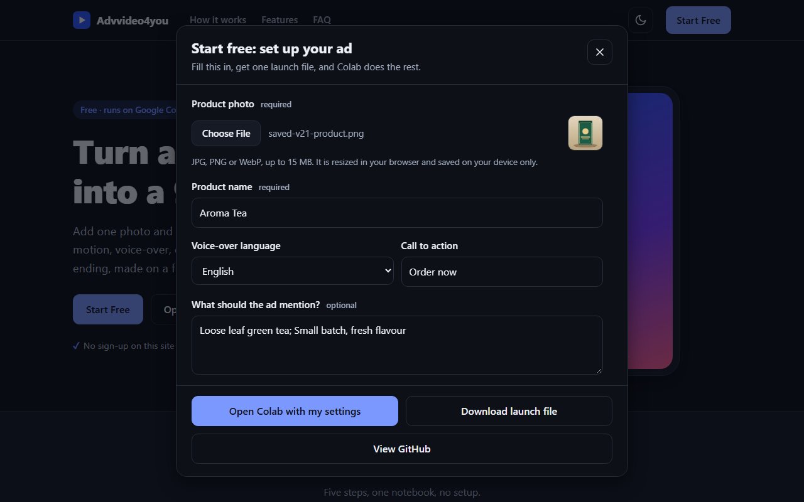
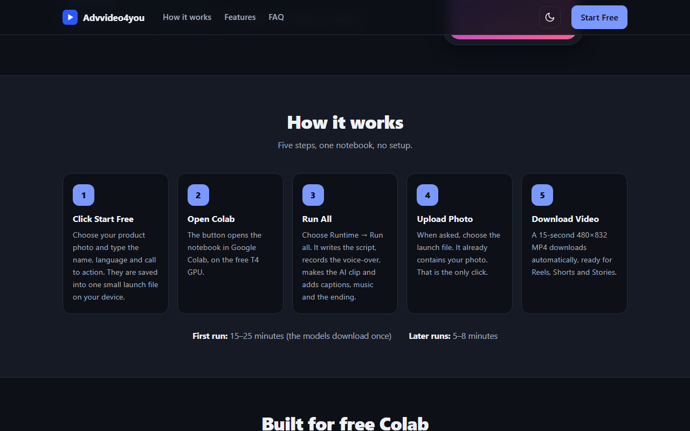

# Advvideo4you

Turn **one product photo** into a **15-second 9:16 AI ad video**: AI motion, an AI-written script, voice-over (Hindi, English or Bangla), animated captions, background music and a closing call-to-action card, on the **free Google Colab T4 GPU**.

**Website:** https://advvideo4you.vercel.app  
**Notebook:** [`colab/Advvideo4you_AI_Ad_Generator.ipynb`](colab/Advvideo4you_AI_Ad_Generator.ipynb)

[](https://colab.research.google.com/github/bnkgroups022-cloud/Advvideo4you/blob/main/colab/Advvideo4you_AI_Ad_Generator.ipynb)



*Layout preview rendered by this project's own FFmpeg commands over a placeholder photo (not an AI clip). Your video uses your photo and the Wan2.1 clip.*

## How to use it

1. **Click Start Free** on the website. Choose your photo, type the product name, pick the language and a call to action.
2. **Open Colab.** The page saves everything (settings plus your photo, resized in your browser) into one file, `advvideo-launch.json`, and opens the notebook. Nothing is uploaded to a server.
3. **Run All.** In Colab press `Runtime -> Run all` (T4 GPU; if it is not selected: `Runtime -> Change runtime type -> T4 GPU`).
4. **Upload Photo.** When the upload button appears, choose `advvideo-launch.json`. That is the only click. (You can upload just a photo instead; the notebook then asks for the name, language and CTA.)
5. **Download Video.** The finished MP4 downloads automatically.

**Estimated time:** first run 15–25 minutes (about 22 GB of models download once), later runs 5–8 minutes. These are estimates, not measurements; see [Read this first](#read-this-first).

Colab cannot receive parameters through a link, which is why settings travel in the launch file.

| Start Free dialog | How it works |
|---|---|
|  |  |

## What you get

- **480×832 MP4** (Wan's native vertical size, nothing is upscaled), H.264 + AAC, exactly 15 seconds, 30 fps, `+faststart`.
- **AI motion, looped smoothly.** The ~2-second Wan clip plays forward and backward with no repeated turning frames (blended up to 30 fps), under a slow zoom (6% to 16% over the video) and a slight pan, with a 0.5 s fade in and fade out.
- **Script:** hook, three feature lines and your CTA. A small LLM (Qwen2.5-1.5B-Instruct) writes it; the output is validated (length, correct script, no digits or risky claims) and replaced by curated templates if it fails. If you fill in "What should the ad mention?", only that is stated.
- **Voice-over:** Piper TTS, fitted into the 15 seconds (re-synthesised faster, up to 1.35x, if needed). The CTA is spoken when the closing card appears.
- **Captions:** timed to the voice, on rounded dark boxes with a shadow, above the bottom 20% of the frame (where phone apps put their buttons). Drawn by FFmpeg through libass, which also shapes Hindi and Bangla correctly; without libass the same layout is drawn with `drawtext` on rectangular boxes. An SRT file is saved too.
- **Closing card (last 3 seconds):** the product name, your CTA (default "Order Now") and "WhatsApp Today" (Hindi and Bangla versions of the phrases), animated.
- **Music:** an original synthesised loop (CC0), faded in and out, at about 20% of the voice's loudness and ducked a little more while the voice speaks.
- **Video model:** Wan2.1 VACE-1.3B through the official Wan-Video/Wan2.1 repository, your photo as frame 0, 33 frames, 18 steps.

## Speed

- The script model and the Wan weights start downloading as soon as your file is uploaded, while the packages install (`python -m advvideo.pipeline --prefetch`).
- The prompt is fixed, so its T5 embeddings are encoded once and cached; the model files are kept in `/content` (or in your Drive with `CACHE_TO_DRIVE`).
- The shortest safe frame ladder: 33 frames, then 25, then 17 only if the GPU runs out of memory. fp16 first; bf16 only if fp16 overflows.
- The audio work (script, voice, captions, music) runs while the GPU generates the clip.

## Read this first

- **Not yet run end to end on a real Colab T4 by the author.** Running Colab needs a Google sign-in, which the environment this was built in cannot perform. The pipeline was checked by static analysis, 130+ automated logic tests, real FFmpeg renders (in ffmpeg 5.1) of the finished video in three languages, and the website flow with real mouse and keyboard input. The Wan, Piper and LLM stages, the Colab runtime steps and the 15–25 / 5–8 minute estimates are unverified. [`TEST_REPORT.md`](TEST_REPORT.md) lists exactly what was and was not tested.
- **The AI motion is about 2 seconds.** It repeats; the voice, captions, music and closing card carry the ad. If the AI clip cannot be made, the ad is rendered with a slow zoom and pan on your photo and the report says so.
- **Licences:** the Hindi voice is CC BY-NC-SA 4.0 (**non-commercial only**). See [`THIRD_PARTY_LICENSES.md`](THIRD_PARTY_LICENSES.md).
- AI-written lines are not verified facts. Review the script (`script.json` is saved next to the video) before publishing.

## Repository layout

| Path | Purpose |
|---|---|
| `index.html` | The website: single static file, no build step |
| `colab/Advvideo4you_AI_Ad_Generator.ipynb` | One Run-all cell: upload, background download, install, run the pipeline, download |
| `advvideo/spec.py` | Output format (480×832, 15 s, 30 fps, 3 s closing card) |
| `advvideo/config.py` | Launch-file format, validation, upload classification |
| `advvideo/script.py`, `llm_worker.py` | Script generator (LLM + validation + templates) |
| `advvideo/voice.py`, `tts_worker.py` | Piper voices, licences, 15-second timeline, voice mixing |
| `advvideo/captions.py` | SRT, wrapping, rounded animated captions, closing card (ASS, drawtext fallback) |
| `advvideo/music.py` | Synthesised background music, level matching to the voice |
| `advvideo/render.py` | FFmpeg commands (loop, zoom/pan, captions, audio mix) and output checks |
| `advvideo/wan_launcher.py` | Wan2.1 VACE on a T4 (patches applied in memory) |
| `advvideo/pipeline.py` | Orchestration and `--prefetch`; the GPU stage runs alongside the audio work |
| `tests/` | Logic tests (pytest style, plain `assert`) |
| `docs/screenshots/` | Screenshots used in this README |
| `TEST_REPORT.md` | What was tested, how, and what was not |
| `vercel.json`, `favicon.*`, `og.png`, `robots.txt`, `sitemap.xml` | Static-site config and SEO |

## Development

```bash
pip install numpy pillow pytest
python -m pytest tests
```

The site deploys to Vercel from `main` with no build step. The notebook clones this repository at run time, so pushing to `main` updates it.

## Version

See [`VERSION`](VERSION), [`CHANGELOG.md`](CHANGELOG.md) and [`RELEASE_NOTES.md`](RELEASE_NOTES.md).

## Licence

Code: MIT (see `LICENSE`). Models, voices, fonts and music carry their own licences, listed in [`THIRD_PARTY_LICENSES.md`](THIRD_PARTY_LICENSES.md). The screenshots in `docs/screenshots/` are original to this project (the placeholder product is an illustration drawn by code).
